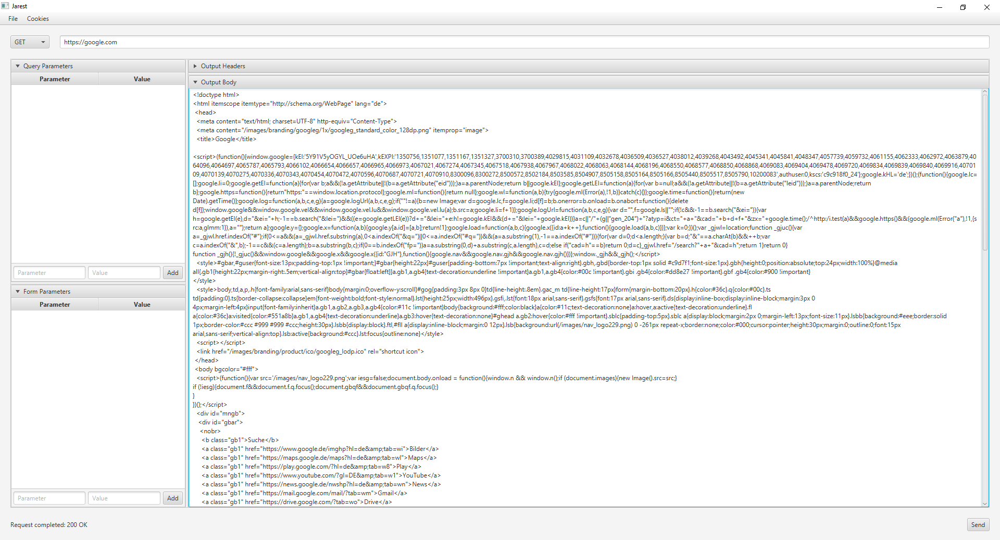
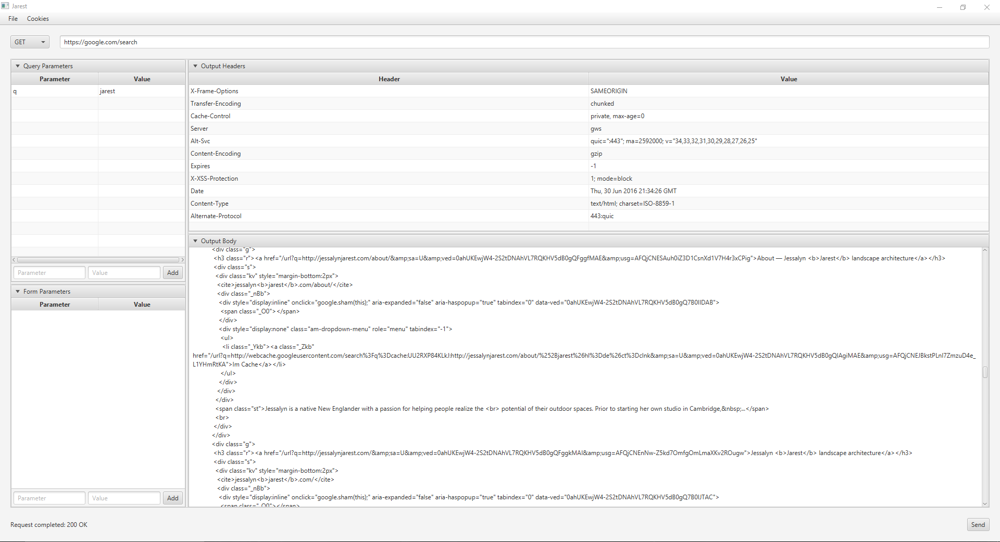

# jarest

A simple application to test your REST Api, written in Java with JavaFX.
Features are:

- Send a GET or POST request to any server and receive a pretty printed response (If a known format is returned).
- View headers of the response
- Set and send query parameters with an easy to use form
- Same for POST parameters
- Cookiemanagement with the ability to view and remove each
- Freely arrangeable user interface to focus on what is currently important to you

Sample 1 | Sample 2
:--------:|:--------:
 | 

### Requirements

- [Java](http://www.oracle.com/technetwork/java/javase/downloads/jre8-downloads-2133155.html) (At least Version 8)
- JavaFX (Included in Java Installation in most cases. If not, [Google](https://www.google.de/search?q=javafx+download+%3Cplatform%3E) how to install it on your platform.

### Installation and Running

Download the [latest release](https://github.com/rubengees/jarest/releases/latest). If you are using Windows you can directly run the .jar file. If you are on Linux or you want to run the file from the terminal, run the following command:

```bash
java -jar jarest.jar
```
